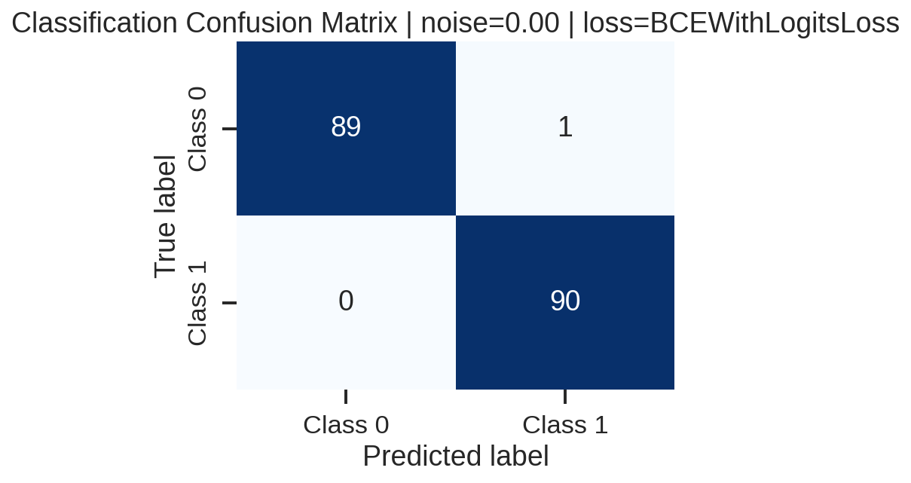
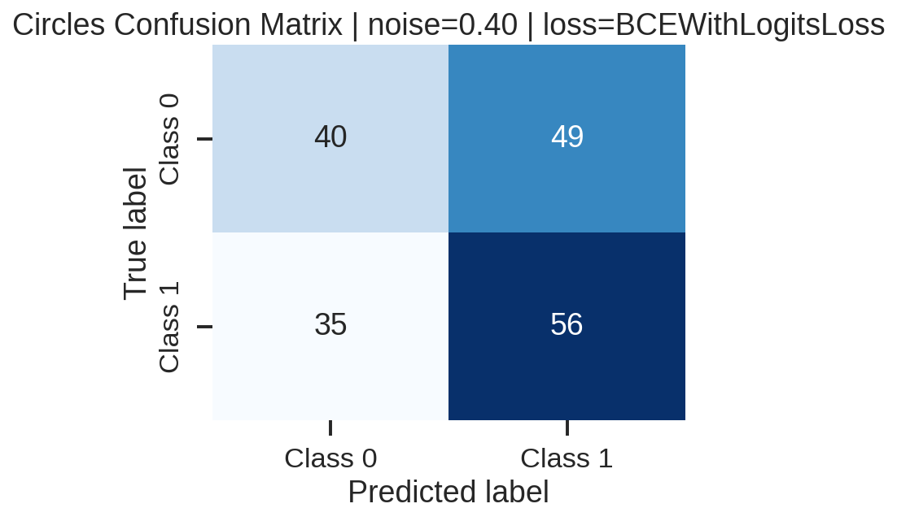
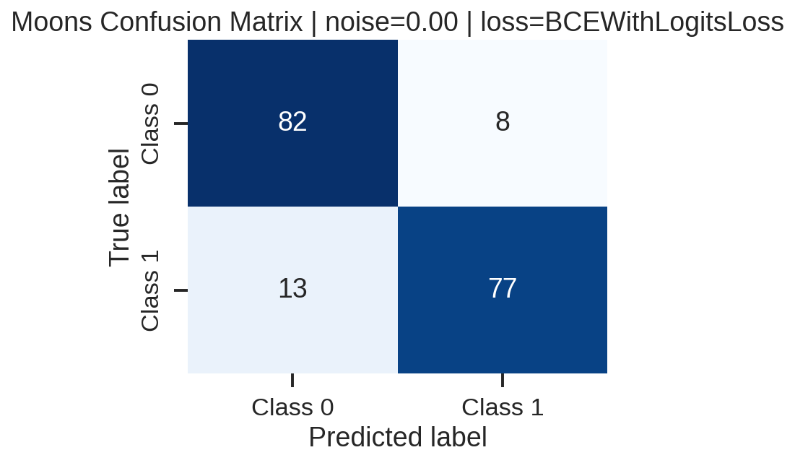

# Binary Classification Challenge (Bônus)

## Visão geral

Este repositório documenta o desafio bônus de classificação binária da disciplina de MLOps (Unidade 1). O objetivo foi analisar como diferentes níveis de ruído, funções de perda e métricas de avaliação afetam uma regressão logística implementada em PyTorch quando treinada sobre dados sintéticos gerados com scikit-learn.

## Estrutura do projeto

```
U1_Bonus/
├── notebooks/          # Notebook principal com os experimentos
├── results/            # Figuras de fronteira de decisao, matrizes de confusao e curvas de perda
├── src/                # Classe Architecture utilizada como arcabouco de treino
├── extra.txt           # Dependencias extras utilizadas na gravacao e automacao
├── requirements.txt    # Dependencias Python
└── README.md           # Este documento
```

## Ambiente e dependências

- Python 3.10.10 (testado).
- Dependências Python listadas em `requirements.txt`.
- Para executar o notebook via linha de comando e gravar vídeo foram utilizadas as ferramentas descritas em `extra.txt` (nbconvert, ipykernel, etc.).

Crie um ambiente virtual limpo e instale as dependências:

```powershell
python -m venv .venv
.\.venv\Scripts\Activate
pip install -r requirements.txt
```

Para execução automatizada do notebook (opcional para pipelines CI/CD):

```powershell
jupyter nbconvert --execute --to notebook --inplace notebooks/noise_experiments.ipynb
```

Em ambientes Linux foi necessário instalar `jupyter-core` previamente (`sudo apt install jupyter-core`).

## Como reproduzir os experimentos

1. Ative o ambiente virtual e instale as dependências conforme descrito acima.
2. Abra `notebooks/noise_experiments.ipynb` no Jupyter e execute todas as células (Kernel -> Restart & Run All).
3. Ao final da execução são gerados automaticamente:
   - `results/metrics_summary.csv` com métrica consolidada por dataset, ruído e função de perda.
   - Figuras com sufixos `_decision_boundary_`, `_confusion_` e `_loss_curve_` refletindo cada combinação explorada.
4. Utilize o CSV para alimentar a discussão no relatório e na apresentação em vídeo.

## Pipeline de experimentos

- **Geração dos dados:** três distribuições sintéticas (`make_classification`, `make_circles`, `make_moons`) com 300 amostras cada e ruído gaussiano variando de 0.0 a 0.4 em passos de 0.1.
- **Modelo:** regressão logística em PyTorch com camada linear única (`in_features=2`, `out_features=1`) seguida de sigmoid quando utilizada com `BCELoss`.
- **Treinamento:** a classe `Architecture` (`src/architecture.py`) organiza loaders, ciclos de treinamento/validação, reprodutibilidade (seed 42) e registro de perdas.
- **Métricas:** accuracy, precision, recall, f1-score e matriz de confusão extraídos via scikit-learn para cada combinação de dataset, ruído e função de perda.
- **Persistência:** todas as figuras e métricas são salvas em `results/` para documentação e inclusão no relatório/vídeo.

## Principais resultados

Os valores abaixo correspondem a `BCEWithLogitsLoss`, que apresentou comportamento numericamente quase idêntico ao de `BCELoss` (diferenças < 1e-5 em todas as métricas). Optou-se por relato único para evitar repetição.

### make_classification (problema linearmente separável)

| Ruido | Accuracy | Precision | Recall | F1 |
| ----- | -------- | --------- | ------ | -- |
| 0.00  | 0.9944   | 0.9890    | 1.0000 | 0.9945 |
| 0.10  | 0.9500   | 0.9348    | 0.9663 | 0.9503 |
| 0.20  | 0.9111   | 0.8925    | 0.9326 | 0.9121 |
| 0.30  | 0.8722   | 0.8587    | 0.8876 | 0.8729 |
| 0.40  | 0.8000   | 0.8293    | 0.7556 | 0.7907 |

Mesmo com 40% de ruído a regressão logística manteve desempenho aceitável, mas a fronteira deixa de ser nítida e a taxa de falsos positivos cresce (vide matriz de confusão abaixo).

### make_circles (fronteira não linear)

| Ruido | Accuracy | Precision | Recall | F1 |
| ----- | -------- | --------- | ------ | -- |
| 0.00  | 0.4278   | 0.4058    | 0.3111 | 0.3522 |
| 0.10  | 0.4333   | 0.2500    | 0.0667 | 0.1053 |
| 0.20  | 0.4611   | 0.4568    | 0.4111 | 0.4327 |
| 0.30  | 0.4944   | 0.5056    | 0.4891 | 0.4972 |
| 0.40  | 0.5333   | 0.5333    | 0.6154 | 0.5714 |

Modelos lineares não conseguem capturar a topologia circular: o ganho de acurácia com ruído maior ocorre porque o ruído aproxima a distribuição de uma separação linear, mas com custo de confiabilidade baixa.

### make_moons (duas luas intercaladas)

| Ruído | Accuracy | Precision | Recall | F1 |
| ----- | -------- | --------- | ------ | -- |
| 0.00  | 0.8833   | 0.9059    | 0.8556 | 0.8800 |
| 0.10  | 0.7944   | 0.8022    | 0.7935 | 0.7978 |
| 0.20  | 0.7556   | 0.7263    | 0.7931 | 0.7582 |
| 0.30  | 0.7167   | 0.7126    | 0.7045 | 0.7086 |
| 0.40  | 0.6278   | 0.6267    | 0.5465 | 0.5839 |

Há uma queda consistente conforme o ruído cresce, mas o modelo ainda supera a baseline aleatória (50%).

- `BCELoss` requer que a saída seja uma probabilidade (aplicar sigmoid explicitamente). Em baixos níveis de ruído pode ocorrer pequena instabilidade numérica devido à saturação da sigmoid.
- `BCEWithLogitsLoss` combina a função sigmoid internamente com a BCE, oferecendo maior estabilidade numérica (evita underflow/overflow) e é recomendado como padrão em implementações robustas.

Frente à quantidade de figuras geradas, abaixo estão as que melhor resumem as discussões — cada par combina fronteira de decisão e matriz de confusão com o mesmo nível de ruído:








## Conclusões
- Modelos lineares respondem bem a dados quase lineares (`make_classification`), mas se degradam de forma quase linear com ruído crescente.
- Em distribuições não lineares (`make_circles` e `make_moons`), o limite do modelo fica evidente: a fronteira de decisão não acompanha a geometria original e parte da melhoria aparente ocorre pela destruição da estrutura pelos ruídos maiores.
- As métricas de precisão e recall degradam de forma similar, indicando que o ruído introduz erros equilibrados (sem viés marcante para falso positivo ou negativo).
- `BCEWithLogitsLoss` é preferível por estabilidade numérica, mesmo quando o ganho em métricas é marginal.


## Video da apresentacao

- Link para vídeo (até 10 min): **[Bônus MLOPs](https://youtu.be/aljD2p9K33A)**.


## Checklist do desafio
- [x] Dataset sintético gerado com funções do scikit-learn e ruído variável.
- [x] Modelo de regressão logística implementado em PyTorch.
- [x] Treinamento estruturado com a classe `Architecture` fornecida.
- [x] Comparação entre `BCELoss` e `BCEWithLogitsLoss` documentada.
- [x] Métricas accuracy, precision, recall, f1-score e matrizes de confusão registradas.
- [x] Fronteiras de decisão, matrizes de confusão e curvas de perda salvas em `results/`.
- [x] Vídeo de apresentação anexado ao README.

