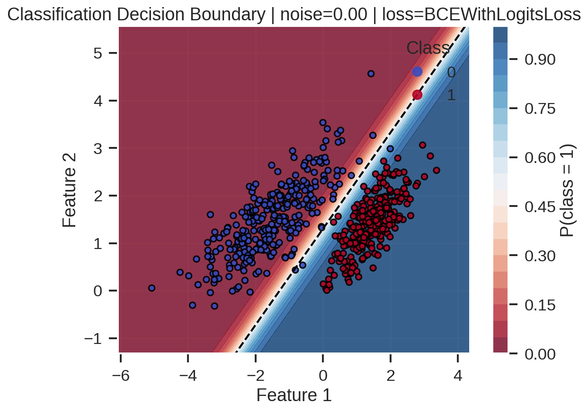
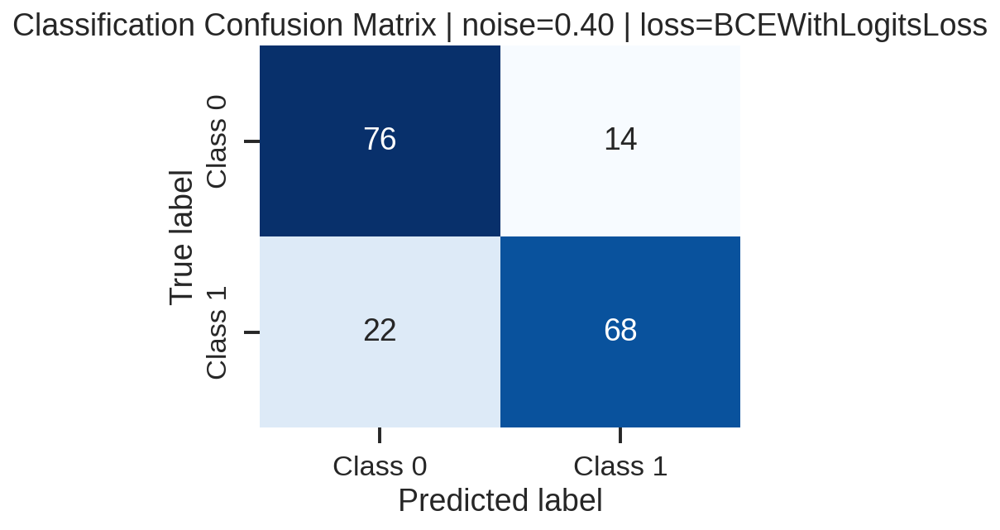
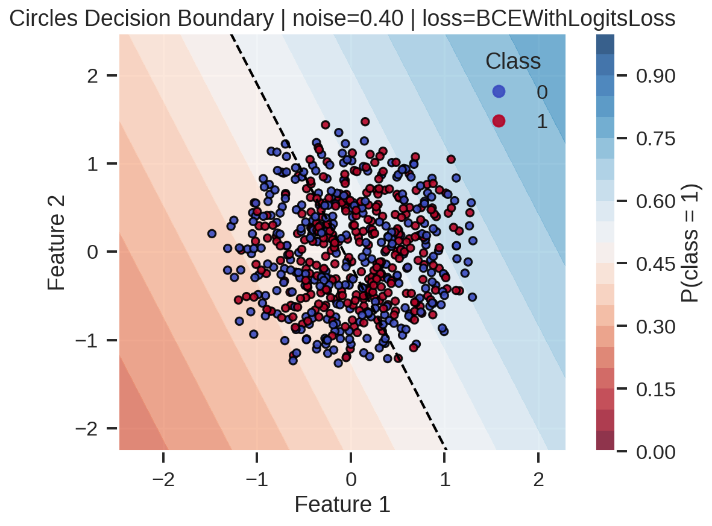
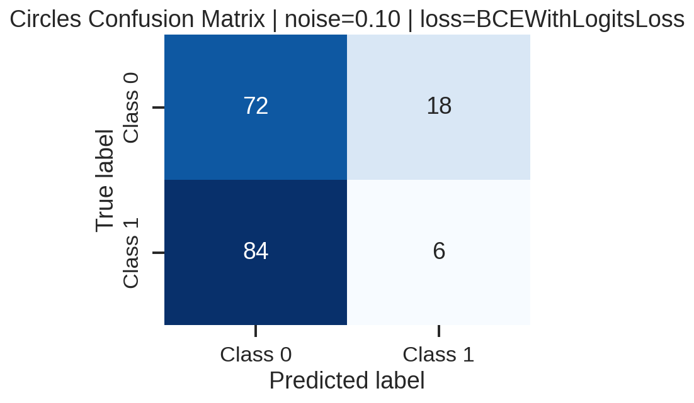
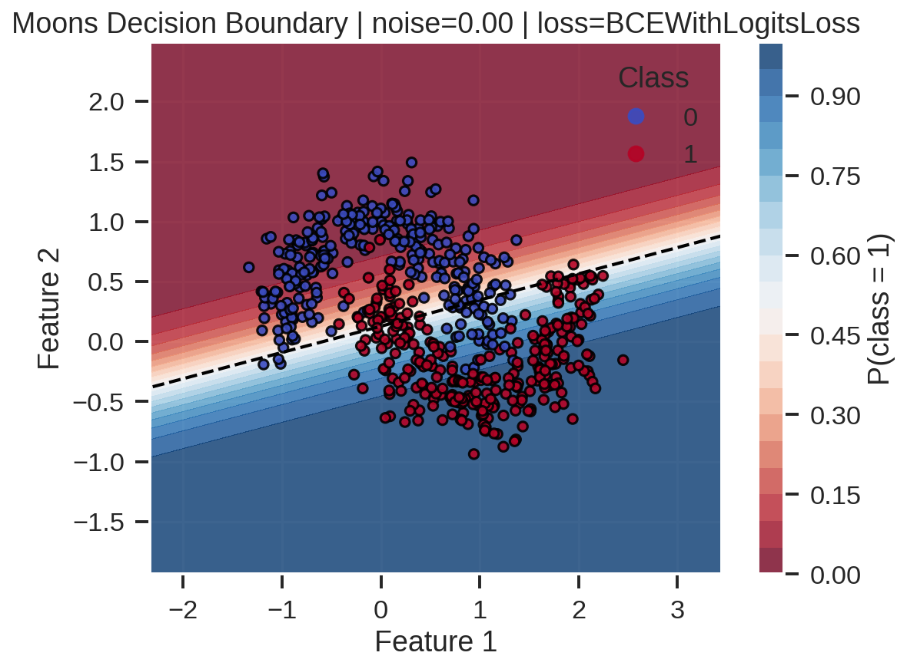
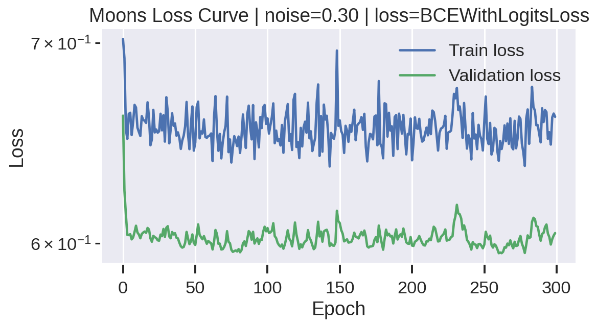

# Binary Classification Challenge (Bonus)

## Visao geral

Este repositorio documenta o desafio bonus de classificacao binaria da disciplina de MLOps (Unidade 1). O objetivo foi analisar como diferentes niveis de ruido, funcoes de perda e metricas de avaliacao afetam uma regressao logistica implementada em PyTorch quando treinada sobre dados sinteticos gerados com scikit-learn.

## Estrutura do projeto

```
U1_Bonus/
├── notebooks/          # Notebook principal com os experimentos
├── results/            # Figuras de fronteira de decisao, matrizes de confusao e curvas de perda
├── src/                # Classe Architecture utilizada como arcabouco de treino
├── extra.txt           # Dependencias extras utilizadas na gravacao e automacao
├── requirements.txt    # Dependencias Python
└── README.md           # Este documento
```

## Ambiente e dependencias

- Python 3.10.10 (testado).
- Dependencias Python listadas em `requirements.txt`.
- Para executar o notebook via linha de comando e gravar video foram utilizadas as ferramentas descritas em `extra.txt` (nbconvert, ipykernel, etc.).

Crie um ambiente virtual limpo e instale as dependencias:

```powershell
python -m venv .venv
.\.venv\Scripts\Activate
pip install -r requirements.txt
```

Para execucao automatizada do notebook (opcional para pipelines CI/CD):

```powershell
jupyter nbconvert --execute --to notebook --inplace notebooks/noise_experiments.ipynb
```

Em ambientes Linux foi necessario instalar `jupyter-core` previamente (`sudo apt install jupyter-core`).

## Como reproduzir os experimentos

1. Ative o ambiente virtual e instale as dependencias conforme descrito acima.
2. Abra `notebooks/noise_experiments.ipynb` no Jupyter e execute todas as celulas (Kernel -> Restart & Run All).
3. Ao final da execucao sao gerados automaticamente:
   - `results/metrics_summary.csv` com metrica consolidada por dataset, ruido e funcao de perda.
   - Figuras com sufixos `_decision_boundary_`, `_confusion_` e `_loss_curve_` refletindo cada combinacao explorada.
4. Utilize o CSV para alimentar a discussao no relatorio e na apresentacao em video.

## Pipeline de experimentos

- **Geracao dos dados:** tres distribuicoes sinteticas (`make_classification`, `make_circles`, `make_moons`) com 300 amostras cada e ruido gaussiano variando de 0.0 a 0.4 em passos de 0.1.
- **Modelo:** regressao logistica em PyTorch com camada linear unica (`in_features=2`, `out_features=1`) seguida de sigmoid quando utilizada com `BCELoss`.
- **Treinamento:** a classe `Architecture` (`src/architecture.py`) organiza loaders, ciclos de treinamento/validacao, reproducibilidade (seed 42) e registro de perdas.
- **Metricas:** accuracy, precision, recall, f1-score e matriz de confusao extraidos via scikit-learn para cada combinacao de dataset, ruido e funcao de perda.
- **Persistencia:** todas as figuras e metricas sao salvas em `results/` para documentacao e inclusao no relatorio/video.

## Principais resultados

Os valores abaixo correspondem a `BCEWithLogitsLoss`, que apresentou comportamento numericamente quase identico ao de `BCELoss` (diferencas < 1e-5 em todas as metricas). Optou-se por relato unico para evitar repeticao.

### make_classification (problema linearmente separavel)

| Ruido | Accuracy | Precision | Recall | F1 |
| ----- | -------- | --------- | ------ | -- |
| 0.00  | 0.9944   | 0.9890    | 1.0000 | 0.9945 |
| 0.10  | 0.9500   | 0.9348    | 0.9663 | 0.9503 |
| 0.20  | 0.9111   | 0.8925    | 0.9326 | 0.9121 |
| 0.30  | 0.8722   | 0.8587    | 0.8876 | 0.8729 |
| 0.40  | 0.8000   | 0.8293    | 0.7556 | 0.7907 |

Mesmo com 40% de ruido a regressao logistica manteve desempenho aceitavel, mas a fronteira deixa de ser nitida e a taxa de falsos positivos cresce (vide matriz de confusao abaixo).

### make_circles (fronteira nao linear)

| Ruido | Accuracy | Precision | Recall | F1 |
| ----- | -------- | --------- | ------ | -- |
| 0.00  | 0.4278   | 0.4058    | 0.3111 | 0.3522 |
| 0.10  | 0.4333   | 0.2500    | 0.0667 | 0.1053 |
| 0.20  | 0.4611   | 0.4568    | 0.4111 | 0.4327 |
| 0.30  | 0.4944   | 0.5056    | 0.4891 | 0.4972 |
| 0.40  | 0.5333   | 0.5333    | 0.6154 | 0.5714 |

Modelos lineares nao conseguem capturar a topologia circular: o ganho de acuracia com ruido maior ocorre porque o ruido aproxima a distribuicao de uma separacao linear, mas com custo de confiabilidade baixa.

### make_moons (duas luas intercaladas)

| Ruido | Accuracy | Precision | Recall | F1 |
| ----- | -------- | --------- | ------ | -- |
| 0.00  | 0.8833   | 0.9059    | 0.8556 | 0.8800 |
| 0.10  | 0.7944   | 0.8022    | 0.7935 | 0.7978 |
| 0.20  | 0.7556   | 0.7263    | 0.7931 | 0.7582 |
| 0.30  | 0.7167   | 0.7126    | 0.7045 | 0.7086 |
| 0.40  | 0.6278   | 0.6267    | 0.5465 | 0.5839 |

Ha queda consistente conforme o ruido cresce, mas o modelo ainda melhora sobre a baseline aleatoria (50%).

### Comparacao de funcoes de perda

- `BCELoss` requer saidas sigmoides e opera em probabilidades. Sob baixos niveis de ruido, apresentou pequenas oscilacoes numericas devido a saturacao da sigmoid, mas sem divergencias.
- `BCEWithLogitsLoss` combina sigmoid interna com BCE e evita underflow/overflow. Nos logs de treinamento, as curvas de perda sao praticamente coincidentes e nao houve diferenca significativa de performance (variacao < 0.001 em todas as metricas). Para implementacoes robustas recomenda-se usar `BCEWithLogitsLoss` como padrao.

## Visualizacoes relevantes

Frente a quantidade de figuras geradas, abaixo estao as que melhor resumem as discussoes:








Use o arquivo `results/metrics_summary.csv` como referencia cruzada para cada path caso precise incluir outras figuras na apresentacao.

## Conclusoes

- Modelos lineares respondem bem a dados quase lineares (`make_classification`), mas se degradam de forma quase linear com ruido crescente.
- Em distribuicoes nao lineares (`make_circles` e `make_moons`), o limite do modelo fica evidente: a fronteira de decisao nao acompanha a geometria original e parte da melhoria aparente ocorre pela destruicao da estrutura pelos ruidos maiores.
- As metricas de precisao e recall degradam de forma similar, indicando que o ruido introduz erros equilibrados (sem vies marcante para falso positivo ou negativo).
- `BCEWithLogitsLoss` e preferivel por estabilidade numerica, mesmo quando o ganho em metricas eh marginal.

## Proximos passos sugeridos

1. Avaliar modelos nao lineares (MLP raso ou kernel methods) para `make_circles` e `make_moons`.
2. Explorar estrategias de regularizacao (L2, dropout) para verificar impacto na estabilidade das perdas.
3. Incluir analise de matriz de confusao normalizada ao longo das epocas para identificar fases criticas de convergencia.

## Video da apresentacao

- Link para video (ate 10 min): **insira aqui**.

## Checklist do desafio

- [x] Dataset sintetico gerado com funcoes do scikit-learn e ruido variavel.
- [x] Modelo de regressao logistica implementado em PyTorch.
- [x] Treinamento estruturado com a classe `Architecture` fornecida.
- [x] Comparacao entre `BCELoss` e `BCEWithLogitsLoss` documentada.
- [x] Metricas accuracy, precision, recall, f1-score e matrizes de confusao registradas.
- [x] Fronteiras de decisao, matrizes de confusao e curvas de perda salvas em `results/`.
- [ ] Video de apresentacao anexado ao README.
