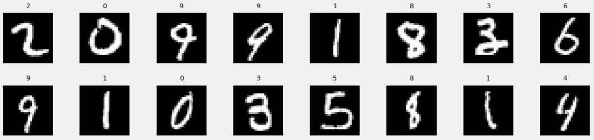
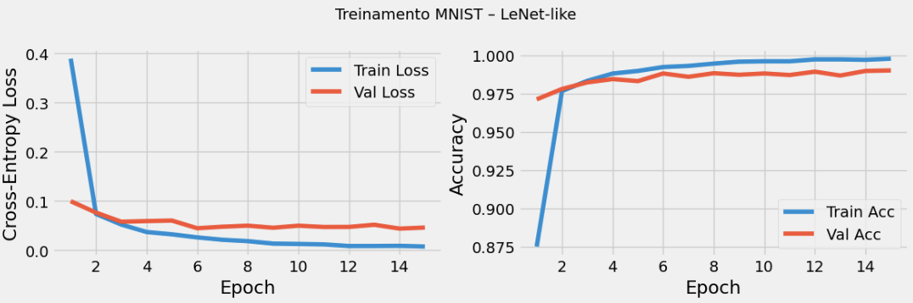
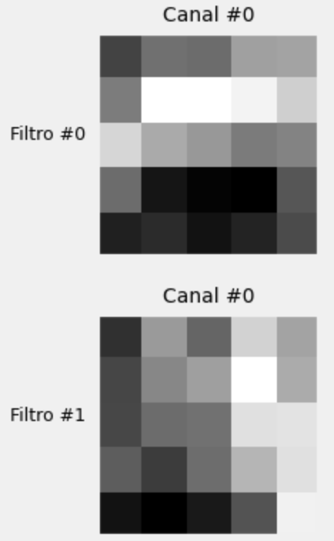

# Trabalho 01 – Unidade 2: LeNet aplicado ao MNIST

Este repositório documenta o experimento desenvolvido no notebook `trabalho01_U2.ipynb`, que implementa o checklist da disciplina de MLOps utilizando o dataset **MNIST** e uma arquitetura **LeNet-like**. O fluxo completo envolve preparação do dataset, definição da arquitetura, instrumentação com hooks para capturar ativações intermediárias, treinamento monitorado e análise dos resultados.

Link da explicação em vídeo: https://youtu.be/9844X_QFVqo

## Requisitos e preparação do ambiente

- Python 3.9.13
- Dependências listadas em `requirements.txt`

Passo a passo sugerido:
1. (Opcional) Criar e ativar um ambiente virtual:
	- **macOS/Linux (bash/zsh)**
	  ```bash
	  python3 -m venv .venv
	  source .venv/bin/activate
	  ```
	- **Windows (PowerShell)**
	  ```powershell
	  python -m venv .venv
	  .\.venv\Scripts\Activate.ps1
	  ```
2. Instalar dependências principais:
	```bash
	python -m pip install --upgrade pip
	pip install -r requirements.txt
	```
3. Ajustar a instalação do PyTorch conforme o ambiente:
	- CPU only:
	  ```bash
	  pip install --index-url https://download.pytorch.org/whl/cpu torch torchvision
	  ```
	- Com CUDA, consulte <https://pytorch.org/get-started/locally/> e substitua o `index-url` pela variante da sua GPU.
4. (Opcional) Registrar o kernel do ambiente virtual para uso no VS Code:
	```bash
	python -m ipykernel install --user --name trabalho01_venv --display-name "Python (trabalho01_venv)"
	```

## Guia rápido de execução

1. Abra o repositório no VS Code.
2. Selecione o kernel correspondente ao ambiente virtual (ou o interpretador Python desejado).
3. Execute as células do notebook `trabalho01_U2.ipynb` em ordem (ou utilize *Run All*).
4. Ao final, exporte as imagens desejadas e substitua os arquivos em `data/` para atualizar as figuras referenciadas ao longo deste README.

## Estrutura lógica do notebook

- **Células 1–2:** Introdução e checklist da entrega.
- **Células 3–6:** Definições de utilidades, configuração de seeds e classe `Architecture` com métodos de treinamento, avaliação e visualização.
- **Célula 7:** Preparação do dataset MNIST, divisão treino/validação e criação do `WeightedRandomSampler`.
- **Célula 8:** Amostras do conjunto de treino para inspeção visual.
- **Células 9–11:** Montagem da arquitetura LeNet-like e contagem de parâmetros treináveis.
- **Células 12–13:** Laço de treinamento de 15 épocas e plot das curvas de loss/accuracy.
- **Células 14–18:** Registro de hooks, captura de ativações, filtros e feature maps.
- **Células 19–20:** Avaliação em validação/teste e análise qualitativa final.

## Pipeline de dados

- Dataset: `torchvision.datasets.MNIST`, com 60k imagens de treino e 10k de teste (28×28, escala de cinza).
- Transformações: conversão para tensor e normalização `mean = 0.5`, `std = 0.5`.
- Particionamento: 90% treino / 10% validação a partir do conjunto de treino original, com `random_split` e seed 42.
- Amostragem: `WeightedRandomSampler` para mitigar possíveis desequilíbrios entre classes.
- `DataLoader`: `batch_size = 64`, *shuffle* via sampler no treino e iteração sequencial em validação/teste.



## Arquitetura LeNet-like

A rede é implementada como um `nn.Sequential`:
- `Conv2d(1 → 6, kernel_size=5, padding=2)` + ReLU + MaxPool(2×2)
- `Conv2d(6 → 16, kernel_size=5)` + ReLU + MaxPool(2×2)
- `Conv2d(16 → 120, kernel_size=5)` + ReLU
- Flatten
- `Linear(120 → 84)` + ReLU
- `Linear(84 → 10)` (logits)

Otimizador: SGD (`lr = 0.01`, `momentum = 0.9`)

Função de perda: `CrossEntropyLoss`

## Hiperparâmetros de treinamento

- Épocas: 15
- Batch size: 64
- Seed global: 42 (para torch, numpy e random)
- *Device*: CPU detectada durante a execução registrada (`device(type='cpu')`)

## Métricas coletadas

| Conjunto      | Loss final | Accuracy final |
|---------------|------------|----------------|
| Treino        | 0.0072     | 0.9979         |
| Validação     | 0.0459     | 0.9902         |
| Teste         | 0.0327     | 0.9915         |

> Valores obtidos via células 12 e 19 do notebook, após 15 épocas.



## Instrumentação com hooks

- Hooks registrados para todas as camadas principais (`conv*`, `relu*`, `pool*`, `flatten`, `fc*`).
- As ativações são armazenadas em `Architecture.visualization` e posteriormente renderizadas com funções auxiliares.
- A remoção dos hooks é feita após a coleta para evitar efeitos colaterais em execuções subsequentes.




## Principais conclusões

- A LeNet apresenta capacidade suficiente para convergir rapidamente no MNIST, estabilizando métricas por volta da 3ª época.
- O `WeightedRandomSampler` mantém o balanceamento de classes nos minibatches, contribuindo para curvas de treinamento estáveis.
- A análise dos feature maps confirma a hierarquia de abstração: filtros iniciais focados em bordas/curvas e camadas profundas capturando padrões mais simbólicos.
- Os erros residuais concentram-se em dígitos visualmente ambíguos, sugerindo a exploração de técnicas de *data augmentation* ou arquiteturas mais profundas para ganhos marginais.


